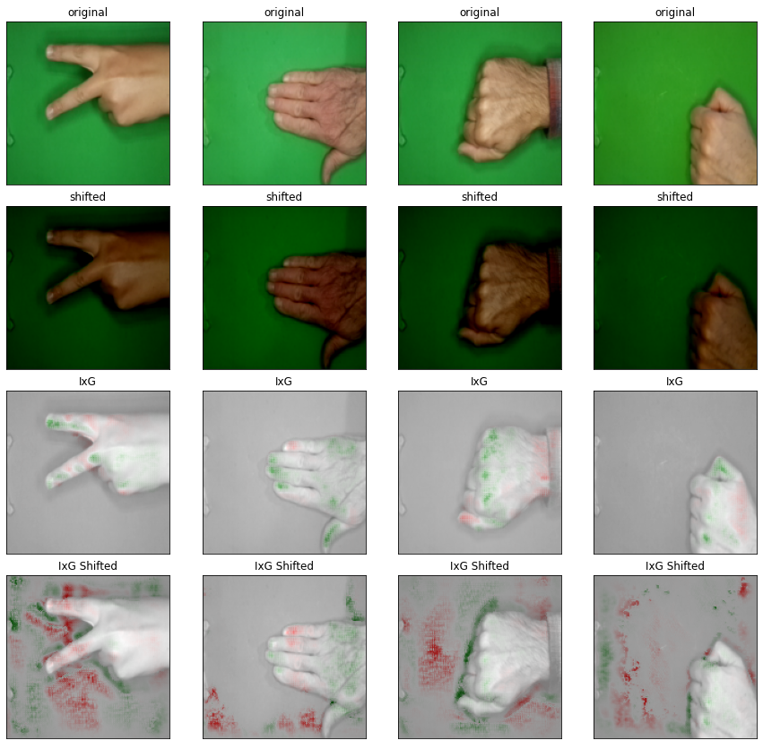

# Course on Explainables for AI: Saliency Methods

Nowadays machine learning models are being applied to solve more and more tasks that directly affect our daily lives, or might in the near future, such as self-driving cars (video segmentation), illness diagnosis from medical data and imagery, and credit rating pretiction of banks, to name a few. With the growing and seemingly coming ubiquity of these models we might ask ourselves the question: **"Can we trust this models prediction?"**.

Major prediction error of the model in a real world scenarion might unfairly deny a possibly trustworthy customer a credit for example. This is on the 'minor inconvenience' side of the scale (at least from the bank's perspective) to tragedies possibly even involving heavy injuries or even death, in case, for example, a self-driving car didn't detect a pedastrian crossing the streets in its video feed.

The keyword here is **decision making**. A Machine learning model uses a dataset of values and labels to learn an abstract decision making rule that (in the best case) reflects the true distribution of real world problem. This learned model is then used to perform predictions on data-points it has never seen before in the training and outputs a prediction. This can be in the form of a segmented image, where the model tried to classify individual pixels, a 'True', or 'False', or a particular credit rating for a potential customer. So whatever the model predicts is then used either directly to facillitate a decision in the real world or might influence a domain expert that might then decide based on what they can deduce from the model and other factors. Imagine a doctor here deciding whether a particular tumor is ill or good natured.

<p align="center">
  
  <br>
  <span align="center">Sources: <a href="#1">[1]</a> and <a href="#2">[2]</a></span>
 </p>


With this We hope we are on the same page that knowing whether the predictions your own or used machine learning model can be trusted or not is critical in many applications. That is where explainability techniques come into place. With these we want to be able to take a glance at what might be behind the eventual decision making of our model and what has contributed to a particular prediction, to make sure that what the model has learned is in line with domain knowledge on what features are relevant for a prediction.

However, as we all know, not all machine learning applications are critical, take a look at Amazon product recommendations or youtube video suggestions. User tailored recommendations might highly increase the platform use or lead to higher revenues but are not lifethreatening if the predictions are wrong sometimes. Even in these cases it is useful to search for explanations for our predictions to get a better understanding of what results are possible or to increase model performance with more understanding.

But now, onto the main issue at hand... We already mentioned some of the key arguments of why we want to use an explainability method on our machine learning models, but how do they work and what are possible issues with them? In this blog post we will be taking a look at <b>saliency methods</b> for explainability, which is one of the easiest method classes to understand and apply.

## What are Saliency Methods?
The word saliency refers to particularly important or prominent and these methods are indeed true to their word meaning, as saliency methods quantitatively rate all input features by how much they contributed, positively or negatively, to producing a particular output. This by itself is fairly abstract, but if we combine all input features in a meaningful way and visualize them, then we can see what parts of our input were responsible for a given prediction. This process is very intuitive for images as inputs, and we will continue staying at this particular set of inputs for simplicity for the rest of the blogpost, but saliency is by no means limited to only image applications. For images we can reconstruct a **saliency map** from the rated input vector back to an image where we color the individual pixels by their contribution magnitude to the output. Then we can also overlap this result with the original input image to directly find the culprit pixels. Depending on the specific method we can visualize pixels contributing positively and negatively, or only the positive contributions. But more on that later. Here's our first example of an applied saliency method:

<p align="center">
  <br>
  <span align="center">Source: <a href="#3">[3]</a></span>
 </p>

The first visual impression of the most basic saliency method, also called **Vanilla Gradients** is admittedly a little underwhelming. This example uses an image classification task for various objects and the image pixel brightness shows a particular pixel's positive contribution to the model's correctly predicted object class. So what can we interpret from these images? We can confirm that the model used pixels that align with the objects in the image and can say that the predictions were at least not made by looking at completely irrelevant image regions. With other methods we can extend this to also contain the negative contributions, so the pixels that were reducing the probability of the chosen output class and also produce aggregate contribution regions.

## Why is saliency useful?

Using saliency maps we can find areas a model is influenced by to produce specific class predictions, which can be very useful to ensure that the prediction is based on the feature we want and not an environmental bias for example. Furthermore it can be used to gain more insight into the model by looking at model failure cases, what features had high attribution that don’t seem to be related to the object in question? When we approach our model with these considerations in mind we can then think of how we might change the model to avoid bad results in these cases and increase the model's performance. Another nice aspect is that we have no abstract numeric score as the result, that can be very difficult to define for complex tasks but instead a heatmap where we can use our visual intuition to confirm the high importance features. Saliency maps **sometimes** allow easy visual and intuitive explanations.

## Methods
Different saliency methods fall into 2 broad categories:
* **Gradient-only**:
This method class only uses gradient magnitude as a measure of importance in feature space, so large activations would indicate a high importance on a specific output category. Here, changes in specific pixel’s values would heavily influence the prediction probabilities and thus the predicted output category.
Methods in this category are Vanilla Gradients, Gradients x Input, and Grad-CAM.

* **Path-attribution methods**:
Different form the gradient only methods, path-attribution methods compare the input image and its backpropagated gradients to a reference image (baseline) to construct pixel attribution. Individual pixel importance comes from the average difference between classification scores of the input image and interpolated baseline values that are attributed back to individual input pixels.
Intuitively a black baseline image would represent the impact a pixel has on the prediction, by looking at various degrees of brightness of it and finally its absense. This method class contains model specific-methods such as Integrated Gradients, as well as model-agnostic methods such as LIME and SHAP.

### Compared Methods
From the nowadays large zoo of different saliency methods and their derivatives for this blog we settled on giving a short introduction on the most basic and widespread methods. In the following experiment we compared Gradient x Input, Integrated Gradients, and Grad-CAM.

#### Vanilla Gradients
The Vanilla Gradients <a href="#8">[8]</a> method works with three simple steps. First we make a forward pass with our input image. Then perform the backward pass to the input layer, for which we normally wouldn't compute the gradients for, but these are exactly what we are looking for. The gradients give us an estimate of pixel saliency because they are calculated with respect to the predicted output class, and are hence contributing to its prediction probability.
<p align="center">
  
</p>
Here S <sub>a</sub> is the prediction score for output class a.
We then visualize these gradients as a normalized heatmap to see the pixel attributions.

##### The Problem with Vanilla Gradient
As you could see in the previous example of the Vanilla Gradient method we could only see various degrees of positively contributing pixels based on their brightness, but these positive attributions are only one hand of the medal. In the final layer of our model we don't predict the prediction class as a single output, but we rather have logits on the output layer that indicate the probability of the current output being a specific output class instead. So the final prediction of our model is simply the class with the largest probability on this last layer of our model. While positively attributing pixels increase these specific values, there are also pixels that decrease them. These negative attributing pixels have as much of an effect on the final prediction as the positively contributing ones, but why, like can't we just visualize them?

The problem comes from one of the inherent design choises of the neural networks themselves. While our networks are able to learn even non-linear functions using the intruduced non-linear activation functions attached to each of our layers, we can't perfectly backtrack the specific activation values after the calculations were performed. To illustrate where the problem here lies, let's take a look at the activation function we used for our model in the following experiment, **ReLu: X<sub>n+1</sub>(x)=max(0,X<sub>n</sub>)** .

<p align="center">
  <br>
  <span align="center">Source: <a href="#4">[4]</a></span>
</p>

 This means we have an unresolved ambiguity for all activations that were below zero or zero during backpropagation. Vanilla Gradients resolves this simply as follows:
 
 <p align="center">
  &space;0)&space;" title="https://latex.codecogs.com/svg.image?\bg{white}\frac{\delta f}{\delta X_{n}} = \frac{\delta f}{\delta X_{n + 1}} \cdot I(X_n > 0) " />
</p>

Where I is the element-wise indicator function, which is zero where the activation at the lower layer was negative, and one where it is positive or zero.
Hence, all activations that are below zero are cutoff and clamped to zero. Since in the gradient only methods a small gradient or zero means that this activation appears to be completely unimportant, as the gradient magnitude defines the importance in feature space, so our attribution fails to highlight inputs that contribute negatively to the output class. This is called activation saturation [<a href="#6">6</a>, <a href="#6">7</a>].

While there are other activation functions our there that also include some additional non-zero activation (<0) for negative function values, such as **leaky ReLu**, the problem is essentialy still the same, as the attributions are heavily biased towards positive attributions. In some way we need the introduced non-linearity of the model, as otherwise our neural network would only be able to learn linear findings.

#### Gradient x Input
Gradient x Input is a simple extention to the original Vanilla Gradients approach where we interpret the computed gradients on the input features as importance coefficients to the input values. Instead of looking at these coefficients by themselves we now element-wise multiply the input values with their respective gradients and use that as our new saliency map. 

#### Integrated Gradients
*DESCRIBE Method*

#### Grad-CAM
Grad-CAM stands for Gradient-weighted Class Activation Map and a visual explanation for the decision making of convolutional neural networks. Different from the previous methods the gradients in Grad-CAM are not backpropagated to the input layer, but rather only to the last convolutional layer of our model.

First of all we perform a usual forward pass with our input image and use the prediction class score for backpropagation while we set the scores for all the other classes to zero. Then we backpropagate the gradient with respect to our target class back to the last convolution layer, before the fully connected multilayer perceptron part of the network. We then average the gradient values across the different channels of the convolution layer to compute the pooled weight coefficients.

<p align="center">
  
</p>

Where i and j refer to the width and height of the convolution layer. With this we calculate average of the weighted feature map with the layer activations for this layer and apply the ReLu function to get the averaged positive attributions for our output class. After using normalization we can then visualize this coarse activation map and identify regions of high contribution within our input image. By upsampling we can also spread the Grad-CAM attributions to fit the dimensions of the input image to create an overlay map.

## Advantages and Disadvantages of Saliency Methods

### Advantages:

* Only require gradients in the model
* Can be used without or almost without modifying the ML model we want to generate explanations for
* Model specific and post-training, and especially Gradient only methods are usually faster to compute than model-agnostic methods <a href="#6">[6]</a>
* Can be applied on already trained models
* Visual results that can be overlayed with the input image to quickly spot the important features at a glance

### Disadvantages

* Some saliency methods can be highly unreliable and seem to produce inconsistent results with only slight bias addition to the input (Gradient x Input and Integrated Gradients with specific baselines)
* Integrated Gradients, while sometimes input transformation invariant is still dependent on a good choice for a baseline image to compare to
* It is difficult to know whether the resulting explanation is correct as they are only analyzed visually and might only look - about right
* Explanations are for individual predictions and we can make no complete statement about the models performance across the full input space, or the workings of the model as a whole. Aggregating over multiple input sets can relieve this issue to some degree however


## A small Experiment: How reliable are these Methods in Practice?
In this part we wanted to give you an intuition on what can go wrong when simply applying a saliency methods on your model. As mentioned before when we apply our saliency method we are only looking for an explanation of our model on a particular reference image. From a single inference point we can say almost nothing about how our model performs or works on the entirety of the feature space possible input images might look like, and so whatever comes out of our saliency methods needs to always be connected to the input image we provided it. And so in this experiment we take a look at what happens to our expainable, the saliency methods we presented here when we play around with the input images a little.

The used machine learning model is a multilayer convolutional network with pooling steps in between. After the convolutions we then apply a multilayer perceptron with a single hidden layer for the final classification.


```
  class RockPaperScissorsClassifier(ImageClassificationBase):
    def __init__(self):
        super().__init__()
        self.network = nn.Sequential(

            nn.Conv2d(3, 32, kernel_size=3, padding=1),
            nn.ReLU(),
            nn.Conv2d(32, 64, kernel_size=3, stride=1, padding=1),
            nn.ReLU(),
            nn.MaxPool2d(2, 2),

            nn.Conv2d(64, 128, kernel_size=3, stride=1, padding=1),
            nn.ReLU(),
            nn.Conv2d(128, 128, kernel_size=3, stride=1, padding=1),
            nn.ReLU(),
            nn.MaxPool2d(2, 2),

            nn.Conv2d(128, 256, kernel_size=3, stride=1, padding=1),
            nn.ReLU(),
            nn.Conv2d(256, 256, kernel_size=3, stride=1, padding=1),
            nn.ReLU(),
            nn.MaxPool2d(2, 2),

            nn.Flatten(),
            nn.Linear(82944, 1024),
            nn.ReLU(),
            nn.Linear(1024, 512),
            nn.ReLU(),
            nn.Linear(512, 3)
        )

    def forward(self, xb):
        return self.network(xb)
```

This network has then been trained on a Kaggle dataset for classifying images of hand symbols for the game, **'Rock, Paper, Scissors'** <a href="#5">[5]</a>. The dataset contains a total of 2188 images corresponding to the 'Rock' (726 images), 'Paper' (710 images) and 'Scissors' (752 images) hand gestures and was split in a 70/20/10 ratio between a training-, validation-, and test dataset. It was trained for 30 Epochs until we reached 96% accuracy on the validation dataset using gradient descent as optimizer for this experiment.

First up, here are some of the results we can obtain from our trained network on some of the test dataset's images without any changes to the original images.

<p align="center">
  <br>
 </p>

Here we can see that the model seems to base its prediction on different pixel attribution patterns, for example clearly visible for the scissors images, that seem to have a clearly different pattern from the rock images. Grad-CAM does so very prominently.

But now, let's increase the bias of the images. We are only adding a constant number on each channel of the input image, this makes the content for us visually brighter, but doesn't affect the relative pixel color differences. For us each channel value is capped at 255 as maximum brightness, so the visual representation is capped at that value, but the input for the model doesn't know that, so we can have inference anyways. So let's see how the different methods perform:

<p align="center">
  <br>
 </p>

The saliency map for Gradients x Inputs seems to greatly differ from the prediction without the increase of image bias. This seems counter intuitive, but as we can see, the output for Gradients x Inputs is not very stable and reliable as it initally seems, the predicted output class even stayed the same for all of our predictions, but the saliency map looks completely different.

For Integrated Gradients we took a look at the effects of the input shift using different baseline images.

<p align="center">
  <br>
 </p>

From these images we can see that the black baseline image resulted in the best visual results without the shift it was the most sensitive to the shift once it was applied. The random and white baselines didn't change extremly with the white baseline being the most stable of the two, but this is can **only** be said for this particular set of input images and our used model. Under different circumstances choosing a fitting baseline image is a **hyperparameter** for Integrated Gradients and each of them might show different characteristics with varying input pertubations.

Lastly let's look at what the input pertubation does to a Grad-CAM explanation:

<p align="center">
  <br>
 </p>

Well, while some of the general shapes still remain, especially in the first and second images, it is clear that the resulting attribution maps are not really aligning with the optically relevant features of the hands in the images. This effect seems to be strongest for the last of the images, where suddenly most of the empty space of the image with only the green background seems to be very important for determining the target class. This clearly should not be the case if the model really used the shape of the hands for its predictions.

While the values of the prediction logits might have changed completely, the model still predicted the right class in these instances, our different methods delivered completely different explanation for them. So, in general we can't connect the layout of a saliency map to a particular output class and vice-verca, without carefully selecting our input images and hoping that the model creates a good enough prediction and if we are lucky the saliency map also lines up with the input to strenghten our argument for the correctness of our model.

## Conclusion

The results seem like cherry picking at best and fraudulent at worst. But this illustrated how unreliable these methods can be, and that good, but also bad results for saliency methods need to be taken with a grain of salt.

It is important to note that these methods can still be a good indicator on what kind of features the model uses for prediction, however users need to be aware of the existing shortcomings of these techniques and not put too much confidence into a single basket. This also demonstrates the fragility of the **'learned'** concept for a convolutional neural network, at least this model apparently didn't learn of the concepts of these different symbols visible in the training dataset, but learned a fragile notion of classes from the images pixels.


## References
<a id="1">[1]</a> 
Irwan iwe; September 2, 2020; last accessed on 05.08.22
<a href="https://unsplash.com/photos/rbDE93-0hHs">https://unsplash.com/photos/rbDE93-0hHs</a>

<a id="2">[2]</a> 
Brock Wegner; January 14, 2021; last accessed on 05.08.22
<a href="https://unsplash.com/photos/pWGUMQSWBwI">https://unsplash.com/photos/pWGUMQSWBwI</a>

<a id="3">[3]</a> 
Simonyan, Karen, Andrea Vedaldi, and Andrew Zisserman. "Deep inside convolutional networks: Visualising image classification models and saliency maps." arXiv preprint arXiv:1312.6034 (2013).

<a id="4">[4]</a> 
Danqing Liu; November 30, 2017; last accessed on 06.08.22
<a href="https://medium.com/@danqing/a-practical-guide-to-relu-b83ca804f1f7">https://medium.com/@danqing/a-practical-guide-to-relu-b83ca804f1f7</a>


<a id="5">[5]</a> 
Julien de la Bruère-Terreault; 2019; last accessed on 06.08.22
<a href="https://www.kaggle.com/datasets/drgfreeman/rockpaperscissors">https://www.kaggle.com/datasets/drgfreeman/rockpaperscissors</a>


<a id="6">[6]</a> 
Christoph Molnar; July 12, 2021; last accessed on 06.08.22
<a href="https://christophm.github.io/interpretable-ml-book/pixel-attribution.html#fn81">https://christophm.github.io/interpretable-ml-book/pixel-attribution.html#fn81</a>


<a id="7">[7]</a> 
Shrikumar, Avanti, Peyton Greenside, and Anshul Kundaje. "Learning important features through propagating activation differences." International conference on machine learning. PMLR, 2017

<a id="8">[8]</a> 
Simonyan, Karen, Andrea Vedaldi, and Andrew Zisserman. "Deep inside convolutional networks: Visualising image classification models and saliency maps." arXiv preprint arXiv:1312.6034 (2013)